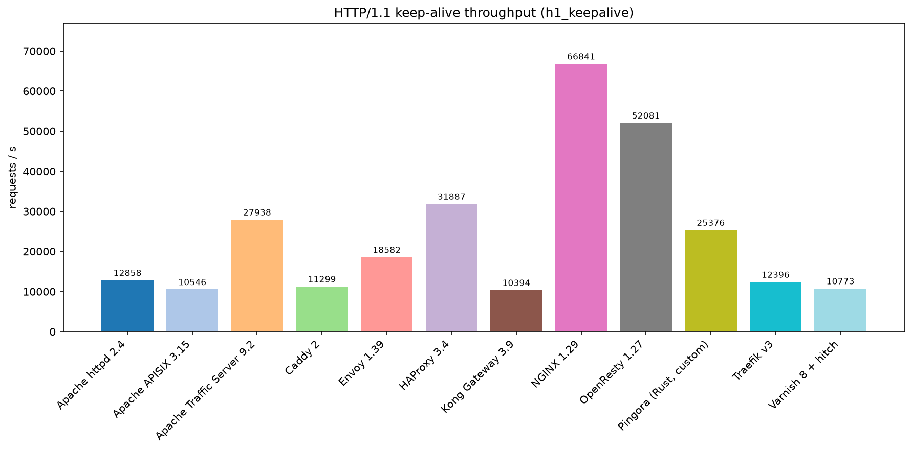
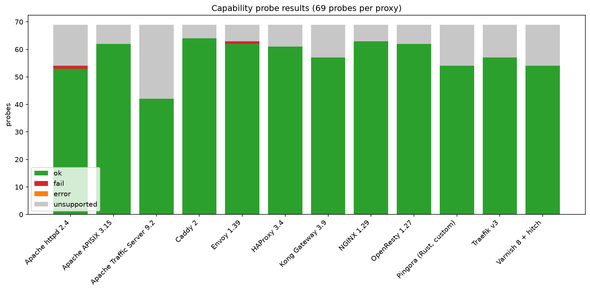
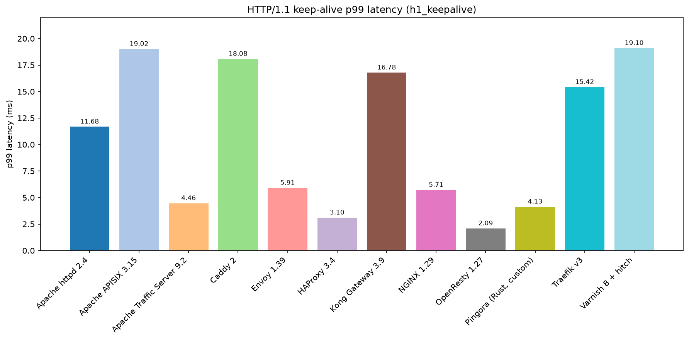

# reverse-proxies — the reverse-proxy lab

**[View Interactive Report](https://karatayberkay.github.io/boiler-test-reverse-proxies/reverse-proxies-report.html)**

A reproducible lab that stands up **twelve reverse proxies in Docker Compose** — NGINX, HAProxy, Caddy, Traefik,
Envoy, Apache httpd, Varnish (+hitch), OpenResty, Kong, APISIX, a custom Pingora (Rust) proxy and Apache Traffic Server —
each configured to the **same contract** ([`docs/contract.md`](docs/contract.md)) in front of the same Go backends, and
measures three things per proxy with one Python harness:

1. **Capabilities** — 69 probes in nine groups (routing, load balancing, protocols, TLS, caching, compression, headers,
   security, operations): host/path/regex/header/query/method routing, weighted / least-conn / hash / sticky
   balancing, retries, outlier ejection, active health checks, canary splits, mirroring, upstream keep-alive, HTTP/2,
   h2c, HTTP/3, WebSocket, SSE, gRPC, h2/TLS/PROXY-protocol upstreams, TCP/UDP/SNI-passthrough, TLS 1.3, mTLS, SNI
   certificates, ACME (against a Pebble test CA), cache hit/purge/stale-on-error, gzip/brotli/zstd, forwarded headers,
   request ids, rate/connection/body limits, timeouts, fault and bandwidth injection, IP lists, basic/JWT/forward auth,
   CORS, security headers, static files, custom error pages, JSON access logs, Prometheus, OpenTelemetry, admin APIs,
   hot reload, Docker label discovery. Each probe records `ok` / `fail` / `error` / `unsupported` (declared in the
   stack's `lab.yaml` with the reason).
2. **Load** — 14 scenarios run from a load-generator container inside the Docker network with the proxy pinned to 4
   cores, backends to 12 and the generator to 8, and exact cgroup-v2 CPU/memory per container: HTTP/1.1 keep-alive
   and no-keep-alive, wrk reference, TLS h1, TLS h2, HTTP/3, 1 MiB bodies, gzip, cache hits, WebSocket echo (k6),
   gRPC (fortio), open-loop 5 000 rps (fortio, no coordinated omission), rate-limit accuracy, and c10k.
3. **Chaos** — a backend killed and restarted under 1 000 rps (errors, failover window, re-admission time) and a
   configuration reload under load (the proxy's native reload mechanism: signal, API, file watch, socket hand-off).

Results: `results/<stack>/latest.json`, the cross-proxy tables in [`results/SUMMARY.md`](results/SUMMARY.md), the
narrative in [`docs/findings.md`](docs/findings.md), one annotated walkthrough per config in
[`docs/configs/`](docs/configs/), the decision matrix in [`docs/proxy-matrix.md`](docs/proxy-matrix.md), and a
self-contained interactive report `docs/report.html` (published copy: https://claude.ai/code/artifact/b99a6c3d-dcad-4b39-a267-902ac25deeb7; `reverse-proxies-report.html` at the repo root is the same page with the fonts embedded for offline use).

## Report sections
The same data as `docs/report.html`, one markdown file per tab:

- [Overview](docs/explanation-overview.md) — one row per proxy: capabilities, h1/TLS-h2/h3/WS throughput, chaos errors, image size, startup.
- [Capabilities](docs/explanation-capabilities.md) — the full 69-probe matrix in nine groups, with the ok/fail/error/unsupported reason for every proxy.
- [Load](docs/explanation-load.md) — all 14 load scenarios: headline metric, p99, proxy CPU, µs/req and errors per proxy.
- [Chaos](docs/explanation-chaos.md) — failover and reload under load per proxy, with reload mechanisms and error samples.
- [Per proxy](docs/explanation-per-proxy.md) — image, version, family, reload mechanism, notes, full capability list and full load results for each of the 12 proxies.

## Results at a glance





## Layout
```
stacks/<proxy>/compose.yaml + lab.yaml + config   one directory per proxy: compose file, native config, harness metadata
shared/                                            Go backend origin, load-generator image, lab PKI, Pebble ACME CA, Jaeger, static origin
harness/pxlab/                                     the harness (contract, probes, load scenarios, chaos, docker/cgroup helpers, report, cli)
results/<proxy>/latest.json + results/SUMMARY.md   raw results + cross-proxy tables (results/logs/ holds the run logs)
docs/                                              contract, per-config walkthroughs, proxy matrix, findings, sources, report.html
skills/                                            Agent Skills: 8 first-party (written from these results) + vendored third-party
scripts/                                           pull-images.sh (registry mirror), run-all.sh (sequential full runs), build-report.py
```

## Stacks (key -> what runs)
| key | proxy | family | image | notes |
|---|---|---|---|---|
| nginx | NGINX 1.29 OSS | C event loop | `nginx:1.29-otel` + prometheus exporter | njs JWT, native ACME, OTel, stream L4, h3 |
| haproxy | HAProxy 3.4 LTS | C event loop | `haproxy:lts` | QUIC, ACME, Lua forward-auth, stick tables, bwlim, cache, promex |
| caddy | Caddy 2 | Go | xcaddy build (ratelimit, l4, jwt, brotli, cache-handler) | automatic HTTPS, h1/h2/h2c/h3 |
| traefik | Traefik v3.7 | Go | `traefik:v3` | file + Docker providers, mirroring, weighted services, ACME |
| envoy | Envoy 1.39 | C++ | `envoyproxy/envoy:v1.39-latest` | file-based xDS, filter chain (ext_authz, jwt, rbac, ratelimit, fault, lua …), QUIC, UDP |
| apache | Apache httpd 2.4 | C event MPM | `httpd:2.4` + apache exporter | mod_proxy/balancer/hcheck/cache_disk/md/brotli/ratelimit/remoteip |
| varnish | Varnish 8 + hitch | C / VCL | `varnish:8.0`, `hitch`, varnishncsa, exporter | grace, purge, saintmode, vsthrottle, digest JWT, reqwest, fileserver |
| openresty | OpenResty 1.27 | C + LuaJIT | opm build (jwt, prometheus, acme, http) | nginx core + Lua limits, auth, purge, ACME, metrics |
| kong | Kong Gateway 3.9 OSS | OpenResty | `kong:3.9` | DB-less declarative config, expressions router, plugins, stream routes |
| apisix | Apache APISIX 3.15 | OpenResty | `apache/apisix:3.15.0-debian` | standalone yaml, widest OSS plugin set, h3, mTLS per SNI |
| pingora | Pingora 0.9 (custom) | Rust | cargo build | ~780 lines of Rust implementing the contract as code |
| ats | Apache Traffic Server 9.2 | C++ | Ubuntu packages | remap + NextHop strategies + header_rewrite + sni.yaml |

## Quick start
Full walkthrough (requirements, per-phase explanation, running everything, reading results, adding a proxy,
troubleshooting): **[STEP-BY-STEP.md](STEP-BY-STEP.md)**.

```bash
cd harness && uv sync                        # Python 3.12 (httpx[http2], websockets, grpcio, h2, pyyaml, rich, typer)
../scripts/pull-images.sh                    # every image referenced by the stacks, through mirror.gcr.io
uv run pxlab build                           # backend + loadgen images, lab PKI (shared/certs), Pebble CA
uv run pxlab shared up                       # origins app1..3/slow/flaky/canary/shadow/b1, Pebble, Jaeger, static, whoami
uv run pxlab run nginx                       # up -> capabilities, load, chaos -> down (~6 min)
uv run pxlab run envoy --phases capabilities --keep
uv run pxlab probe envoy cache_hit           # one probe, verbose, against the running stack
uv run pxlab load haproxy --scenario tls_h2 --seconds 30
uv run pxlab report                          # rebuild results/SUMMARY.md
../scripts/run-all.sh                        # every stack, sequentially, logs in results/logs/
uv run python ../scripts/build-report.py     # rebuild docs/report.html
```
Stack keys: `nginx haproxy caddy traefik envoy apache varnish openresty kong apisix pingora ats`. Only one proxy stack
runs at a time (they share the published ports 18080/18443/…); the shared backends stay up between runs.

## What "the contract" means
Every stack listens on the same ports (8080 http, 8443 https/h3, 8444 mTLS, 8445 SNI passthrough, 8082 PROXY protocol,
9000 tcp, 9001 udp, 9100 metrics, 9101 admin), routes the same hostnames (`weighted.lab`, `hash.lab`, `sticky.lab`,
`cb.lab`, `auth.lab`, `jwt.lab`, `acme.lab`, …) to the same behaviours and the same paths (`/api/`, `/limited`,
`/cacheable/`, `/compressible`, …) to the same features. The probes therefore never know which proxy they are talking
to. A proxy that cannot do something says so in `lab.yaml` (`unsupported: {probe_id: reason}`) and the matrix shows
`--` with the reason instead of a red cross. Details: [`docs/contract.md`](docs/contract.md).

## Results at a glance
See [`docs/findings.md`](docs/findings.md) for the numbers with commentary and [`results/SUMMARY.md`](results/SUMMARY.md)
for every table. Numbers come from one 28-core host with every container on it; they are comparable across proxies,
not absolute.

## Skills
[`skills/`](skills/README.md) contains eight first-party Agent Skills distilled from this lab (compose patterns,
capability mapping per proxy, load testing methodology, TLS/ACME, load balancing & resilience, security hardening,
observability, caching & compression) and vendored third-party skills (API7's APISIX skill, Kong's kongctl skill,
Netdata's troubleshooting trees, a Traefik and a Caddy skill) with their licenses.
